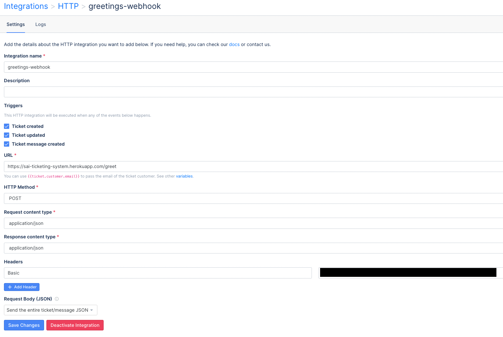

# Automatic Ticketing System for Gorgias Customer Service Portal
​
This app creates an automated response to a customer whenever he/she/they create a new ticket on the Gorgias's Customer Ticketing System.
​
## Implementation Aspects
​
I have built this app using Python as the main source code, running on a Flask Server, powered by a serverless management service-Heroku.
​
## Objective
​
Primary goal is for the ticketing system to send an auto response to a client whenever they create a new ticket.
​
## Gorgias REST API
​
### 1. WebHook Integration
​
Instead of polling for a client's ticket and then formulating  a response, it is more efficient to have a push API method. One such way is to use webhooks.
Gorgias has functionality to allow the developer to create its own integrations as illustrated here.

​
### 2. Heroku PaaS
​
The Webhooks from the Gorgias portal are activated whenever the client creates a ticket, updates a ticket, or creates the message of ticket.
At the listening end, I quickly setup a Flask server which listens to webhooks on Heroku.
​
### 3. Gorgias REST API
​
On receiving the webhook, the server application `app.py` parses the data that came along with the POST API request.
​
It acquires critical data such as the ticket ID, details of the sender & receiver, message body etc.
​
The function `send_email_response()` takes this data as input and passes it to an endpoint which **creates a message** using the [Create a Message](https://developers.gorgias.com/reference/post_api-tickets-ticket-id-messages) endpoint.
​
There is an additional function `send_internal_email()` which too uses the same API, albeit differently.
In this function, the senders and receivers of the note are the same, and the `type` key under `source` dict has the value `internal-note`.
This function however was not executed for reasons explained in Points of Improvement below.
​
## Points of Improvement
​
### 1. Server Overload when external email & internal note is sent at the same time
​
The Heroku PaaS has a limited value and time to host applications. Whenever the Heroku Flask server attempted to create messages, both for external client and for internal user, it invariably ran into 500 Server Overload error. Further analysis of logs and debugging will help resolve the issue.
​
### 2. Filter the webhook send requests
​
The Gorgias webhook integration service sends multiple webhooks when a single event is created. Further analysis will help filter out which of the multiple webhooks is important for automating response.
​
### 3. Pass the input variables as JSON object
​
The critical params such as user's details, sender and receiver's details etc are can be included in a common JSON object. This object can then be passed into as input parameters to the functions - `send_email_response()` and `send_internal_email()`.
​
### 4. Generalisation of date & time values, API key management and other parameters
​
The API keys need to be hidden using the config.py module. The date-time values can be serialised using the outputs of `datetime()` module. Various other parameters too can be generalised.